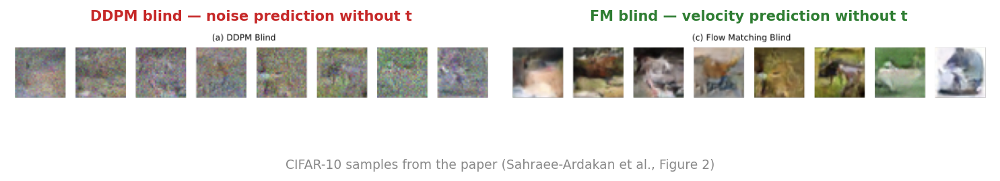

# The Geometry of Noise

> An interactive marimo notebook explaining **why diffusion models don't need their noise-level input** — and where exactly that trick breaks.



*On real images, the difference between training targets is stark. A "blind" U-Net trained to predict noise (left) collapses to mush. The same architecture trained to predict velocity (right) generates clean samples — without ever being told the noise level. This notebook explains why, analytically, on a toy you can scrub by hand.*

---

## What is this?

An interactive companion to [Sahraee-Ardakan, Delbracio & Milanfar (2026), *The Geometry of Noise: Why Diffusion Models Don't Need Noise Conditioning*](https://www.alphaxiv.org/abs/2602.18428v1) — the surprising recent result that you can drop the timestep argument from a diffusion U-Net entirely (`unet(x_t, t)` → `unet(x_t)`) and the sampler still works, *as long as* the data is high-dimensional enough.

Instead of restating the paper's math, this notebook lets you **drag the ambient dimension `D`** and watch every claim emerge as a geometric fact:

- **Concentration of measure.** The classical apple-peel demo: in 100-dimensional space, almost all of a ball's volume sits in its outermost 1% of radius. Drag `D` and see the fraction climb from 3 % at `D = 3` to 99.996 % at `D = 1000`.
- **Shell formation.** Gaussian noise at level `t` concentrates at radius `t·√D`, and shells at different `t` become *disjoint* as `D` grows. So the noise level `t` is encoded in `‖u‖` alone — that's the "trick" the U-Net rides on.
- **Posterior collapse.** Click anywhere on a 2D scatter to place a probe. Watch the posterior `p(t | u)` collapse from a wide prior into a sharp delta as `D` increases. This is the "posterior collapse on `t`" mechanism the paper is named after.
- **The 4-panel sampler experiment.** FM-conditional, FM-blind, EDM-blind, and DDPM-blind on the same 2D-circles dataset, lifted to `Rᴰ`. Drag `D` from 2 to 128 and see exactly which parameterization breaks at which dimension — and watch the paper's hard regime boundary at codimension `D − d > 2` surface, live.

All math is **closed-form analytical**. No neural networks are trained. Every figure recomputes from a single shared `D` slider, and the whole notebook runs in your browser via Pyodide/WASM.

## The four key widgets

<table>
<tr>
  <td width="50%" valign="top">
    
    <p><b>Apple peel.</b> Drag the inner arc to set how thin a "skin" you peel off a <i>D</i>-dimensional ball. At <i>D</i> = 128, peeling just 1 % of the radius removes ~72 % of the volume — most of the ball lives in its outermost shell. This is the geometric foundation everything else builds on.</p>
  </td>
  <td width="50%" valign="top">
    
    <p><b>Shell histogram.</b> Gaussian noise vectors at level <i>t</i> concentrate at radius <i>t</i>·√<i>D</i>, and the shells at different <i>t</i> become <i>disjoint</i> as <i>D</i> grows. So the noise level <i>t</i> is encoded in <code>‖u‖</code> alone — that's the statistical fingerprint the U-Net is reading.</p>
  </td>
</tr>
<tr>
  <td width="50%" valign="top">
    
    <p><b>Posterior <code>p(t | u)</code>.</b> Click anywhere on the 2D scatter to place a probe; the right plot shows the posterior over <i>t</i> at that probe. At high <i>D</i>, the wide prior collapses into a narrow delta — the "posterior collapse on <i>t</i>" the paper is named after, made interactive.</p>
  </td>
  <td width="50%" valign="top">
    
    <p><b>4-panel sampler.</b> FM-conditional (sees <i>t</i>, baseline), FM-blind (paper's headline claim), EDM-blind (paper predicts but never tests — our extension), DDPM-blind (paper's stress test). All four use the same closed-form sampler. Drag <i>D</i> to see which parameterization survives where.</p>
  </td>
</tr>
</table>

## Run it

The notebook ships with [PEP 723](https://peps.python.org/pep-0723/) inline dependencies, so [`uv`](https://docs.astral.sh/uv/) handles everything:

```bash
# Editable, with widgets
uvx marimo edit marimo_notebook.py --sandbox

# Read-only / app view (what a competition judge sees)
uvx marimo run marimo_notebook.py --sandbox
```

It also runs unmodified in [molab](https://molab.marimo.io/) — Pyodide handles all numerics in-browser, no server needed.

## Built with

- **[marimo](https://marimo.io)** — reactive Python notebooks where the dataflow graph drives execution. Move the `D` slider and every dependent figure recomputes automatically; nothing is precomputed or stale.
- **[pywidget](https://github.com/ktaletsk/pywidget)** — pure-Python interactive widgets running in Pyodide/WASM. **Every interactive element here is a pywidget.** No JavaScript bundles, no `_esm` blocks, no kernel round-trips on UI events — the widgets author and update the DOM from Python running in the browser.

The pywidget showcase is part of the point: this notebook is a working demonstration that you can build production-quality interactive scientific visualizations entirely in Python and have them run anywhere Pyodide does — including molab, JupyterLite, and any static-hosted page.

## Walk-through

| Section | What's in it |
|---|---|
| **Hook + TL;DR** | The CIFAR-10 figure, the paper in one paragraph, what to expect |
| **Diffusion in five minutes** | Forward / reverse diffusion widgets — scrub `t` to watch noise being added and removed on a 2D toy |
| **What this paper asks** | Stable Diffusion's training loop in three lines; the paper's twist (`drop t`) |
| **High-dimensional geometry** | Apple-peel widget; reintroducing the toy in `Rᴰ`; the `D` slider |
| **The shell picture** | Shell-formation histogram; "the a-ha — reading `t` from `‖u‖`" |
| **Posterior collapse** | Click-to-probe `p(t \| u)` widget; the mechanism the paper is named after |
| **The experiment** | 4-panel sampler comparison + dynamic regime callout |
| **Brownian sidebar** | A physicist's reflection on why the codimension boundary `D − d > 2` is the same threshold that separates recurrent from transient Brownian motion |

## Paper

Mehrdad Sahraee-Ardakan, Mauricio Delbracio, Peyman Milanfar. *The Geometry of Noise: Why Diffusion Models Don't Need Noise Conditioning.* 2026.
[alphaXiv: 2602.18428](https://www.alphaxiv.org/abs/2602.18428v1)

## Author

[Konstantin Taletskiy](https://github.com/ktaletsk) — April 2026.
Submitted to the [marimo × alphaXiv notebook competition](https://marimo.io/pages/events/notebook-competition).
